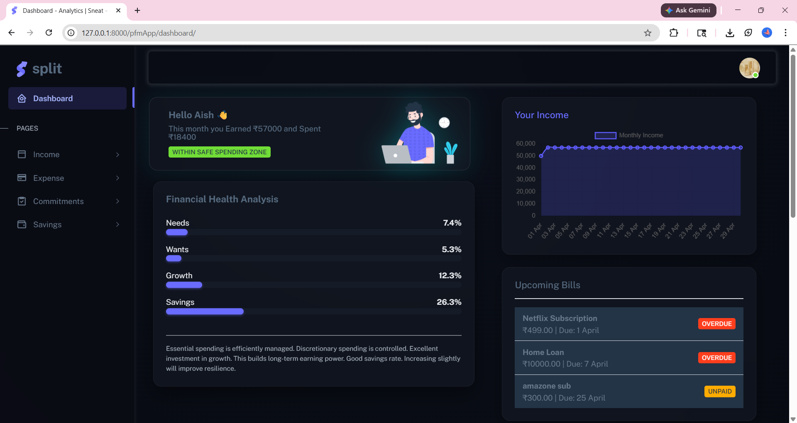
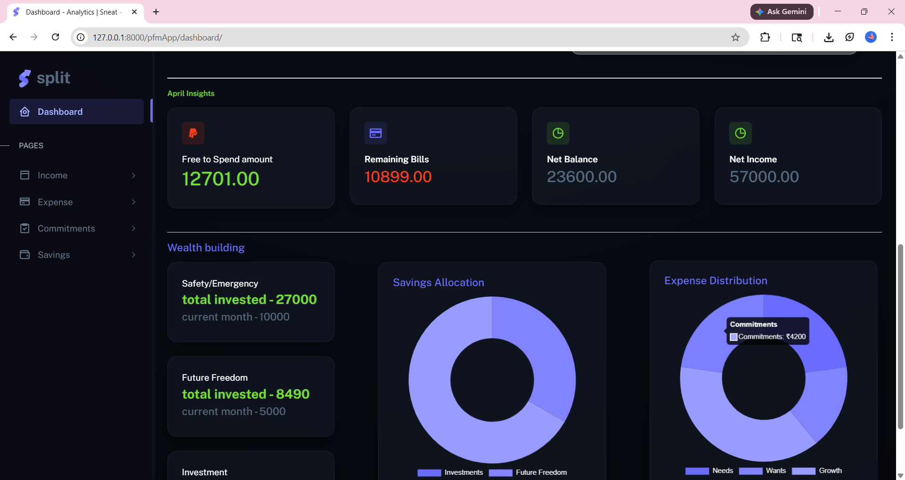
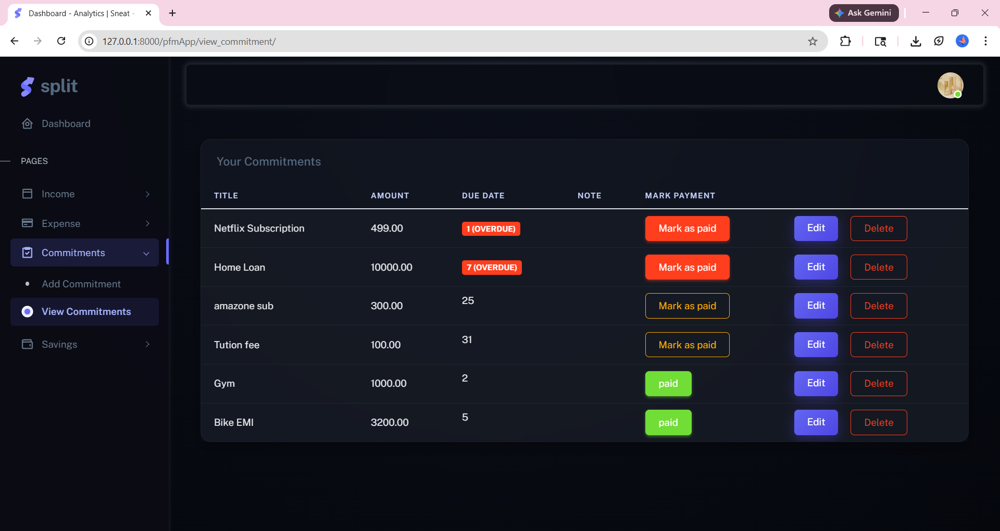
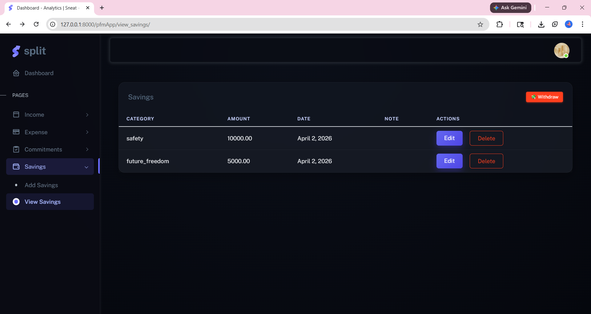
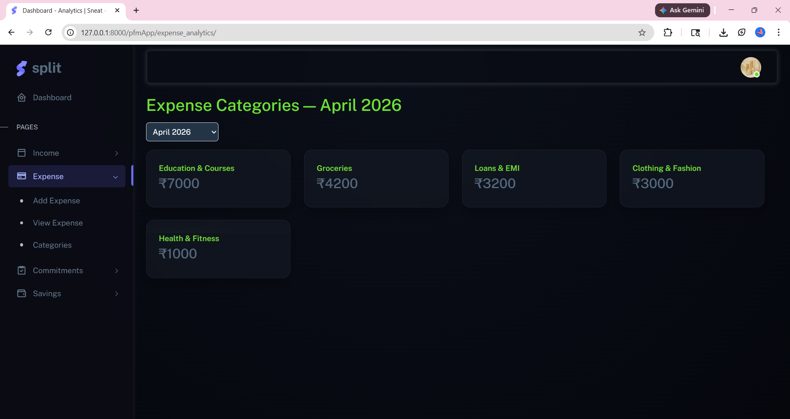

# 💰 SPLIT — Your Personal Finance Manager

> *Built with Django • Beginner-Friendly • Built for Real Life*


---

## 👋 What is SPLIT?

Managing money doesn't have to be scary.

**SPLIT** is a personal finance web app designed for people who are just starting their financial journey — no jargon, no complicated spreadsheets, just a clear picture of where your money is going and how to grow it.

Whether you're a college student tracking your first salary, or someone who's finally decided to take control of their finances — **SPLIT is built for you.**

---

## 🧠 The Finance Philosophy Behind SPLIT

Before we talk about the app, let's talk about money. SPLIT is built around one simple idea:

> **"Every rupee you earn has a job to do."**

When money comes in, it should flow in two directions: **building your future (savings)** and **funding your present (expenses)**. Here's how SPLIT thinks about it:

---

### 🏦 Where Your Money Should GROW — Savings

Think of these as the three pillars of financial security. Before you spend on yourself, allocate to these:

| Pillar | What it is | Why it matters |
|--------|-----------|----------------|
| 🛡️ **Safety / Emergency Fund** | A cash reserve for unexpected events | Car breaks down? Medical bill? This is your financial seatbelt. Aim for 3–6 months of expenses. |
| 🌅 **Future Freedom (Retirement)** | Long-term wealth for when you stop working | Starting early is the single most powerful financial move you can make. Compounding is magic. |
| 📈 **Investments** | Stocks, mutual funds, SIPs, gold | Once your safety net exists, put money to work. This is how wealth is actually built. |

> 💡 **Quick Rule of Thumb:** Try to put at least **20% of your income** into savings across all three categories.
> Even ₹500/month consistently beats ₹5,000 done once and forgotten.

---

### 💸 Where Your Money GOES — Expenses

Every expense in SPLIT falls into one of four categories, so you always know what kind of money you're spending:

| Category | What it covers | Target |
|----------|---------------|--------|
| 🏠 **Needs** | Rent, groceries, electricity, medicines — the non-negotiables | ~50% of income |
| 🎉 **Wants** | Dining out, movies, new clothes, gadgets — the fun stuff | ~20–30% of income |
| 📚 **Growth** | Courses, books, gym, skill-building — the smart spend | As much as you can |
| 🔄 **Commitments** | EMIs, insurance, subscriptions — fixed monthly obligations | Track carefully |

> 📊 SPLIT's dashboard shows exactly how you're doing against these targets **every single month.**

---

## ✨ Features

### 📊 Smart Dashboard
Your entire financial month, at a glance — the moment you log in:

- 📈 **Live income line chart** — watch how your income builds day by day through the month
- 💵 **Spendable Amount** — exactly how much you have left after savings and pending bills
- 🔴🟢 **Net Balance & remaining commitments** — colour-coded so the status is instant
- 🩺 **Financial Health bars** — visual ratios for Needs / Wants / Growth / Savings vs your income
- 🤖 **AI guidance messages** — personalised feedback that tells you what your numbers actually mean
- 🔔 **Upcoming bills widget** — so nothing sneaks up on you at the end of the month
- 🍩 **Savings allocation & expense distribution** donut charts




---

### 💰 Income Tracking
Log every source of income — salary, freelance, side hustle, pocket money — with date and notes. View, edit, and delete entries any time.

---

### 🧾 Expense Tracking
Every time you spend, log it with a title, amount, date, category, and notes. Clean list view filtered to the current month.

---

### 🔄 Commitment Manager
One of SPLIT's most powerful features. Add your recurring obligations — rent, EMIs, subscriptions — and SPLIT tracks them for you:

- 🔴 **Overdue** / 🟡 **Unpaid** / 🟢 **Paid** status for every bill
- **One-click Mark as Paid** — automatically creates an expense entry for you
- Dashboard always shows your top upcoming bills



---

### 🏦 Savings Manager
Log savings across your three pillars — Safety, Future Freedom, and Investments:

- Monthly savings + **cumulative totals** so you can watch your wealth grow over time
- **Withdrawal support** — safely withdraw from a category (balance-protected)

---

### 🤖 Smart Expense Categorisation (AI-Powered)

This is the engineering showpiece of SPLIT. When you open expense analytics, the app **automatically groups your expenses into meaningful subcategories** using machine learning — no manual tagging needed.

**How it works (4-stage pipeline):**

```
Stage 1 → Merchant Database     — Exact match (Zomato = Dining, HPCL = Fuel)
Stage 2 → Embedding Similarity  — Semantic ML matching with spell correction
Stage 3 → Spell-corrected Match — Handles typos and regional transliterations
Stage 4 → Custom Name Generator — For genuinely novel expenses
```

- Uses **`all-MiniLM-L6-v2`** sentence embeddings + **DBSCAN clustering**
- Covers **24 standard categories** — Fuel, Groceries, Dining, Healthcare, Streaming, and more




---

### 📈 Financial Health Analysis
Beyond just showing numbers, SPLIT reads your spending patterns and gives personalised feedback:

- ⚠️ Flags overspending zones (wants too high, needs consuming too much income)
- ✅ Celebrates good habits (strong savings rate, disciplined discretionary spending)
- 🔔 Warns about high commitment loads
- 💡 Tells you when you have healthy leftover balance to invest more

---

## 🛠️ Tech Stack

| Layer | Technology |
|-------|-----------|
| **Backend** | Django (Python) |
| **Database** | Django ORM (SQLite / PostgreSQL) |
| **Frontend** | Bootstrap 5 + Chart.js + Sneat Admin Theme |
| **ML / AI** | `sentence-transformers` (all-MiniLM-L6-v2) + scikit-learn DBSCAN |
| **Spell Check** | `pyspellchecker` |
| **Charts** | Chart.js (line + doughnut) |
| **Auth** | Django built-in authentication |

---

## 🚀 Getting Started

### 1. Clone & install

```bash
git clone https://github.com/your-username/split.git
cd split
pip install -r requirements.txt
```

### 2. Run migrations

```bash
python manage.py makemigrations
python manage.py migrate
```

### 3. Start the server

```bash
python manage.py runserver
```

### 4. Open in your browser

```
http://127.0.0.1:8000/
```

Register an account, add your first income, and you're off! 🎉

---

## 💬 A Note for Beginners

Managing money isn't about being perfect. **It's about being aware.**

Most people overspend not because they're careless, but because they never see their numbers clearly. SPLIT puts everything in front of you — your income, your spending patterns, your savings progress — so you can make better decisions.

Start small. Log your expenses for one month. See where your money actually goes. Then, slowly, start moving money into **Safety first**, then **Future Freedom**, then **Investments**. Even ₹200 a month matters more than you think.

> *"The best time to start was yesterday. The second best time is right now." 🌱*

---

<div align="center">

Built with ❤️ using Django

**SPLIT — Know Your Money. Grow Your Money.**

</div>
